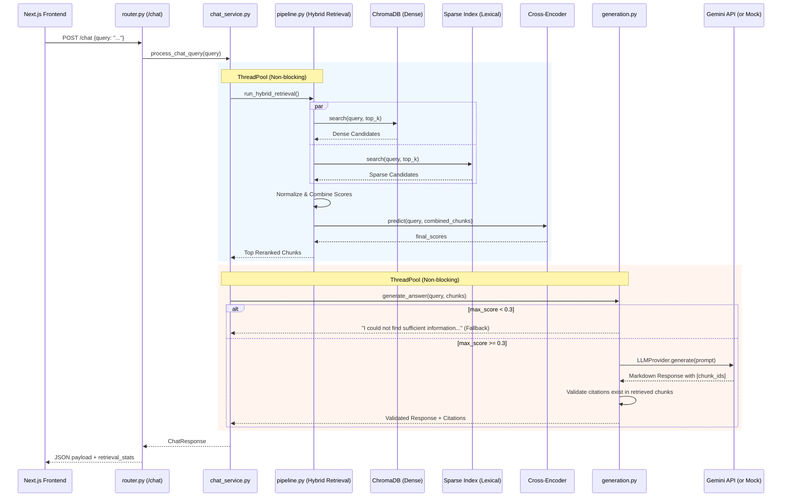

# System Architecture Diagrams

## Chat Flow (Sequence Diagram)

Below is the verified sequence diagram for the `/chat` endpoint. It visualizes the strict layering from the frontend, down through the API orchestration, into the hybrid retrieval pipeline, and finally to the LLM verification logic.

